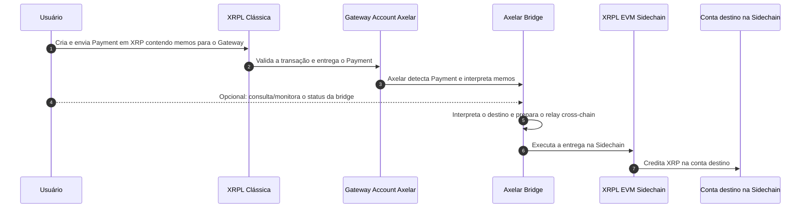
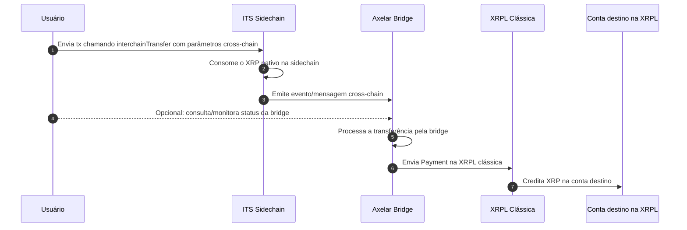

## Diagrama de sequência do fluxo XRPL --> Sidechain

```mermaid
sequenceDiagram
    autonumber
    participant U as Usuário
    participant X as XRPL Clássica
    participant G as Gateway Account Axelar
    participant A as Axelar Bridge
    participant S as XRPL EVM Sidechain
    participant D as Conta destino na Sidechain

    U->>X: Cria e envia Payment em XRP contendo memos para o Gateway
    
    X->>G: Valida a transação e entrega o Payment
    G->>A: Axelar detecta Payment e interpreta memos

    U-->>A: Opcional: consulta/monitora o status da bridge

    A->>A: Interpreta o destino e prepara o relay cross-chain

    A->>S: Executa a entrega na Sidechain
    S->>D: Credita XRP na conta destino

```

## Diagrama de Sequência do fluxo Sidechain --> XRPL

```mermaid
sequenceDiagram
    autonumber
    participant U as Usuário
    participant I as ITS Sidechain
    participant A as Axelar Bridge
    participant X as XRPL Clássica
    participant D as Conta destino na XRPL

    U->>I: Envia tx chamando interchainTransfer com parâmetros cross-chain
    
    I->>I: Consome o XRP nativo na sidechain
    I->>A: Emite evento/mensagem cross-chain

    U-->>A: Opcional: consulta/monitora status da bridge

    A->>A: Processa a transferência pela bridge

    A->>X: Envia Payment na XRPL clássica
    X->>D: Credita XRP na conta destino

    
```