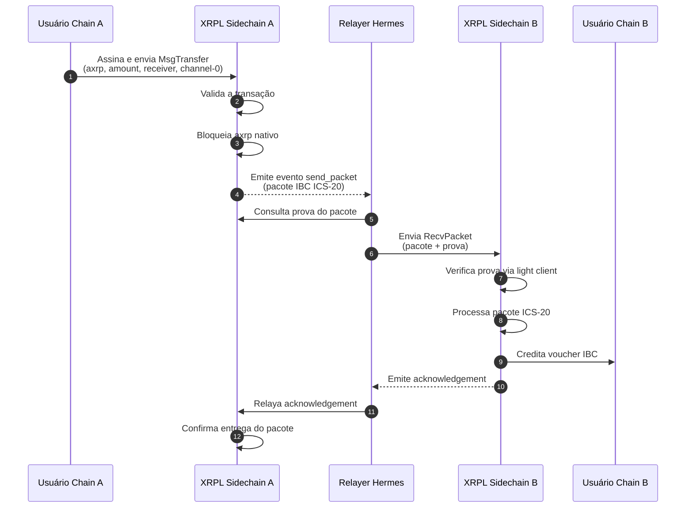

# Inicialização das chains A, B e do Relayer Hermes:
```
docker compose up -d --build
```

## Validação do funcionamento das chains A e B:

Para verificar o funcionamento das chains,  `docker logs -f xrplevm-a` e, em um segundo terminal `docker logs -f xrplevm-b`.

### Verificação dos endpoints:
#### Chain A
##### RPC Cosmos
```
curl http://localhost:26657/status
```
##### RPC EVM
```
curl -H "Content-Type: application/json" \
  -d '{"jsonrpc":"2.0","method":"eth_blockNumber","params":[],"id":1}' \
  http://localhost:8545
```
#### Chain B
##### RPC Cosmos
```
curl http://localhost:36657/status
```
##### RPC EVM
```
curl -H "Content-Type: application/json" \
  -d '{"jsonrpc":"2.0","method":"eth_blockNumber","params":[],"id":1}' \
  http://localhost:9545
```

## Validação do funcionamento do Relayer:

Health Check: `docker exec -it hermes hermes health-check`.

Para validar o arquivo de configuração: `docker exec -it hermes hermes config validate`.

### Importação dos mnemonics para o Hermes:
#### Chain A:
```
docker exec -it hermes sh -lc 'hermes keys add \
  --chain xrplevm_1449999-1 \
  --mnemonic-file /home/hermes/.hermes/mnemonics/relayer-a.txt \
  --key-name relayer-a \
  --hd-path "m/44'\''/60'\''/0'\''/0/0" \
  --overwrite'
```
e, para validar a importação: `docker exec -it hermes hermes keys list --chain xrplevm_1449999-1`
#### Chain B:
```
docker exec -it hermes sh -lc 'hermes keys add \
  --chain xrplevm_1450000-1 \
  --mnemonic-file /home/hermes/.hermes/mnemonics/relayer-b.txt \
  --key-name relayer-b \
  --hd-path "m/44'\''/60'\''/0'\''/0/0" \
  --overwrite'
```
e, para validar a importação: `docker exec -it hermes hermes keys list --chain xrplevm_1450000-1`

### Adicionando fundos às contas do relayer:
#### Chain A:
```
python scripts/fund_relayer_account_a.py
```
#### Chain B:
```
python scripts/fund_relayer_account_b.py
```

### Criação do canal IBC transfer:
```
docker exec -it hermes sh -lc 'hermes create channel \
  --a-chain xrplevm_1449999-1 \
  --b-chain xrplevm_1450000-1 \
  --a-port transfer \
  --b-port transfer \
  --new-client-connection \
  --yes && hermes start'
```

#### Para validar a abertura do canal, execute `docker exec -it hermes hermes query channels --chain xrplevm_1449999-1` para a Chain A, e ` docker exec -it hermes hermes query channels --chain xrplevm_1450000-1` para a Chain B.

### Execução do Relayer Hermes
```
docker exec -it hermes hermes start
```

A saída mostrará algo como:
```
PortChannelId {
        channel_id: ChannelId(
            "channel-0",
        ),
        port_id: PortId(
            "transfer",
        ),
    },
```
Ou seja, o ` channel-0` será o utilizado 

### Transferência Cross-Chain:
Executa uma transferência de token (asset transfer) via protocolo IBC usando padrão ICS-20, da Chain A para Chain B.

```
python tests/transfer_cross_chain.py
```

A saída - também salva no arquivo `logfile.jsonl` - será do tipo:

```
{
  "Source Chain": "xrplevm_1449999-1",
  "Source Port": "transfer",
  "Source Channel": "channel-0",
  "Sender Chain A": "ethm1dakgyqjulg29m5fmv992g2y66m9g2mjn6hahwg",
  "Receiver Chain B": "ethm1dakgyqjulg29m5fmv992g2y66m9g2mjn6hahwg",
  "Amount": "1 XRP",
  "Amount axrp": "1000000000000000000",
  "Code": 0,
  "TxHash": "EC7F3BA4B24238357EB657DC2B9A2AC05B7F79F7D354D782DFA07539D4157EC7"
}
```

### Validação na Chain B:

A confirmação da transferência do token para a Chain B pode ser conferida ao executar o script `check_balance_cosmos.py` com os parâmetros `COSMOS_REST_URL` e `ADDRESS` correspondentes à {API REST COSMOS} da Chain B e {Receiver Chain B}. Por padrão: `COSMOS_REST_URL = "http://localhost:2317"` e `ADDRESS = "ethm1dakgyqjulg29m5fmv992g2y66m9g2mjn6hahwg"`

```
python tests/check_balance_cosmos.py
```

