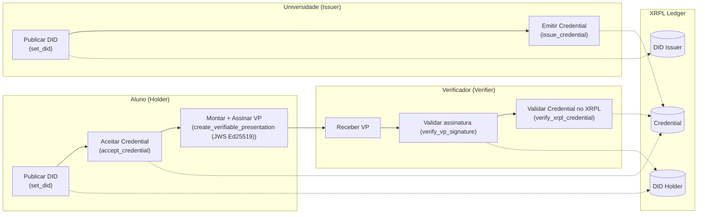

# XRPL

Implementação das roles de Holder, Issuer e Verifier no ledger XRPL.

# Como utilizar?

>[!TIP]
>Ambiente Virtual (Opcional)
><details>
><summary> Windows: </summary>
>
>### Criando o ambiente virtual
>
>```
>python -m venv .venv
>```
>
>### Inicializando o ambiente virtual
>
>```
>source .venv/Scripts/activate
>```
>
></details>

## Instalando dependências
```
pip install -r requirements.txt
```

## Definindo variáveis de ambiente
```
cp .env.example .env
```

## Diagrama de fluxo das operações



## Execução das roles

### Issuer (Universidade)

1. Publicar DID
```
python issuer/set_did.py
```
2. Emitir credencial
```
python issuer/issue_credential.py
```

><details>
><summary>Consultar/Deletar DID (Opcional)</summary>
>   
> 1. Consultar (Retorna objeto DID do ledger) 
>
>```
>python issuer/check_did.py
>```
>
> 2. Deletar (Exclui objeto DID do ledger) 
>
>```
>python issuer/delete_did.py
>```
>
></details>

### Holder (Aluno)

3. Publicar DID
```
python holder/set_did.py
```
4. Aceitar credencial
  >[!Warning]
  > Credencial deve ter sido emitida pelo Issuer antes de poder ser aceita.
```
python holder/accept_credential.py
```
5. Criar Verifiable Presentation (VP)
  >[!Warning]
  > Credencial deve ter sido emitida pelo Issuer antes de poder ser referenciada na VP.
```
python holder/create_verifiable_presentation.py
```
  >[!Note]
  > Por padrão, o caminho da VP criada é `holder/verifiable_presentations/`

><details>
><summary>Consultar/Deletar DID (Opcional)</summary>
>   
> 1. Consultar (Retorna objeto DID do ledger) 
>
>```
>python holder/check_did.py
>```
>
> 2. Deletar (Exclui objeto DID do ledger) 
>
>```
>python holder/delete_did.py
>```
>
></details>

### Verifier

6. Verificar a validade da assinatura EdDSA da VP
  >[!Warning]
  > VP deve ter sido criada pelo Holder (5) para ser verificada.
   ```
   python verifier/verify_vp_signature.py
   ```
7. Verificar a validade da credencial XRPL
  >[!Warning]
  > Credencial deve ter sido emitida pelo Issuer (2) e aceita pelo Holder (4).
   ```
   python verifier/verify_xrpl_credential.py
   ```

