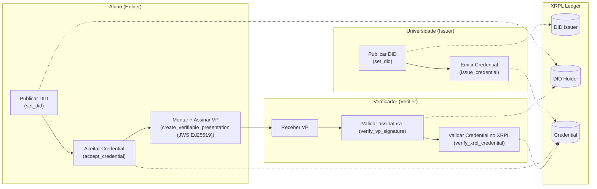

# XRPL

Implementação das roles de Holder, Issuer e Verifier no ledger XRPL.

# Como utilizar?

>[!TIP]
>(Opcional) Ambiente Virtual
><details>
><summary> Windows: </summary>
>
>### Criando o ambiente virtual
>
>```
>python -m venv .venv
>```
>
>### Inicializando o ambiente virtual
>
>```
>source .venv/Scripts/activate
>```
>
></details>

## Instalando dependências
```
pip install -r requirements.txt
```

## Diagrama de fluxo das operações


